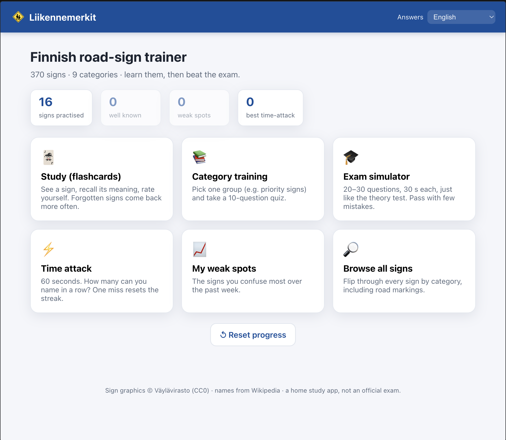
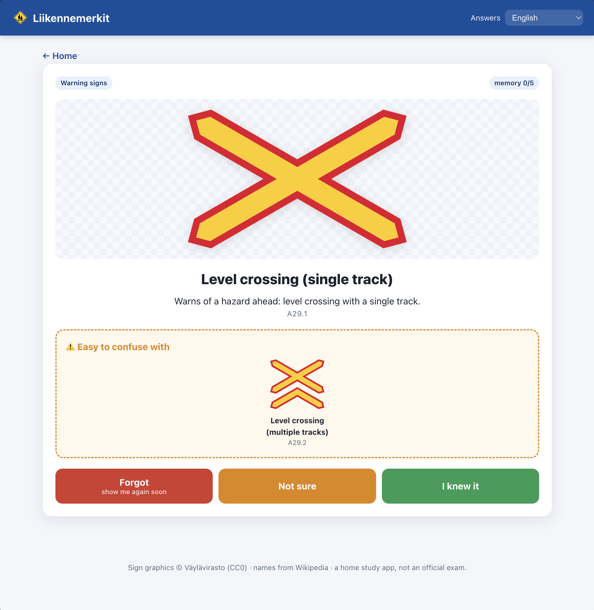

# 🚸 Liikennemerkit — Finnish road-sign trainer

A tiny, free, offline app for learning the Finnish (2020) traffic signs and
practising for the theory exam. No install, no account, no internet needed once
downloaded — just open one file in a browser.

It reuses the official sign graphics already in this repository
(`collection/svg/`, © Väylävirasto, CC0) and adds plain-language
names and meanings parsed from Wikipedia.

## ▶️ Play it now

**<https://nkzinovyeva.github.io/roadSignsTrainer/>**

Nothing to install — open the link in any browser, on phone or computer. Your
progress is saved in that browser (localStorage); nothing is sent anywhere.



## Run it offline / from your own copy

1. Download / clone this repository.
2. Open **`index.html`** in any modern browser (double-click it).

> If sign images don't appear, your browser is blocking local files. Use the
> "local server" option below, or open it in Firefox (which allows it).

### Run it with a local server (optional, most robust)

From the repository root:

```bash
python3 -m http.server 8000
```

Then open <http://localhost:8000/>.

## What's inside



| Module | What it does |
|---|---|
| 🃏 **Study (flashcards)** | A sign appears; recall its meaning, hit *Show answer*, then rate yourself **Forgot / Not sure / I knew it**. A Leitner-style memory box makes forgotten signs come back more often. |
| 📚 **Category training** | Pick one group (Warning, Priority, Prohibitory…) and take a focused 10-question multiple-choice quiz. |
| 🎓 **Exam simulator** | 20–30 random questions, a strict **30-second timer** per question, and a pass threshold — as close as we get to the real theory test. |
| ⚡ **Time attack** | 60 seconds. Name as many signs in a row as you can; one miss resets the streak. Your best run is saved. |
| 📈 **My weak spots** | Every sign you've ever missed and not yet mastered, worst-first, with a one-click drill of the top 5. A sign clears once you answer it correctly 3× in a row — or tap ✓ to dismiss it. (Accuracy figures shown there cover the last 7 days.) |
| 🔎 **Browse all signs** | Flip through every sign by category, including road markings. |

### Progress dashboard 📊

The home screen shows live counters: **signs practised** (every sign you've
answered), **well known** (memory level 4–5), **weak spots** (all-time misses
not yet cleared), and your **best time-attack** streak. Tap any of the first
three to see exactly which signs are in that group. **↺ Reset progress** wipes
all learning data — memory boxes, history, weak spots and your best streak —
while keeping your answer-language choice.

### Signature feature: anti-confusion 🪧

Whenever you pick the wrong answer, the app shows the sign you chose **next to**
the correct one (plus known look-alikes) and reminds you not to mix them up.
Look-alike groups come from the `similar_signs` field in the database (mirror
variants like *bend left / bend right*, plus a curated list of classic
confusions such as *give way ↔ stop*).

## Languages

Use the **Answers** selector in the top bar to choose **Suomi**, **English**, or
**both**. The setting applies everywhere — flashcards, quiz options, answer
reveals, descriptions, category labels and review lists. In **both** mode the
Finnish name stays the headline with the English translation underneath. The
static screens (home, categories, weak spots, browse) update instantly when you
switch; an in-progress quiz/exam/flashcard picks up the new language on its next
card.

## The data

All sign data lives in a single file, [`data/signs.js`](data/signs.js), which
exposes the array as `window.SIGNS` so the app works straight from `file://`.
**Edit it directly** — it's plain JSON apart from the `window.SIGNS = …;`
wrapper. Each entry:

```json
{
  "id": "B5",
  "category": "B",
  "category_fi": "Etuajo-oikeus- ja väistämismerkit",
  "category_en": "Priority and give-way signs",
  "name_fi": "Väistämisvelvollisuus risteyksessä",
  "name_en": "Give way",
  "description_fi": "Kertoo etuajo-oikeudesta tai väistämisvelvollisuudesta: …",
  "description_en": "Tells you about right-of-way or the duty to give way: …",
  "image": "collection/svg/B5.svg",
  "similar_signs": ["B6", "B7"],
}
```

### Editing the database

Open [`data/signs.js`](data/signs.js) and change the relevant entry — add a
name, fix a translation, adjust `similar_signs`, etc. Save and reload the app;
there is no build step. English (and most Finnish) names are aligned with the
official [Väylä road-sign pages](https://vayla.fi/en/transport-network/road-signs)
/ the Väylä Flickr albums; the original import came from
[Luettelo Suomen liikennemerkeistä](https://fi.wikipedia.org/wiki/Luettelo_Suomen_liikennemerkeist%C3%A4)
(Finnish) and [Road signs in Finland](https://en.wikipedia.org/wiki/Road_signs_in_Finland)
(English).

### Coverage & honesty note

- **All 370 signs are named** in both Finnish and English, covering every group
  A–I.
- A few official Väylä titles are duplicated across mirror/variant signs (e.g.
  `Bend`, `Crossroad`, `Filling station`); where helpful, a short
  `(right)/(left)/(odd days)` suffix keeps them distinguishable.
- Descriptions are plain-language framing built from the official name plus the
  sign category. The **name** is the authoritative meaning.

## Files

```
.
├── index.html        # the app (open this)
├── styles.css        # styling
├── app.js            # all logic (study, quiz, exam, time attack, stats)
├── data/
│   └── signs.js      # the database — window.SIGNS (edit this directly)
└── collection/
    └── svg/          # the official sign graphics
```

## License

The code in this repository is released under the [MIT License](LICENSE).

Sign graphics © Väylävirasto / Finnish Transport Infrastructure Agency (CC0,
public domain) — they keep their own terms and are not covered by the MIT
license above.

This is a home study aid, **not** an official exam or reference.
